## 🔗 Navigation

**UP:** [[08 - System/Agent Directives/Agent Directives Hub.md|Agent Directives Hub]]

# GroundZeroOS — Scoping (KISS)

GroundZeroOS is a **minimal**, directive-driven way to keep an Obsidian vault in a shape where agents can reliably:
- discover executable work (phase nodes)
- plan + atomize tasks against a real codebase
- execute tasks and **append full outputs** to log nodes
- keep vault structure consistent over time via maintenance skills

**Vault = source of truth.** State lives in Obsidian frontmatter + directory structure + markdown checkboxes.

> **v1.0 note:** This version incorporates learnings from shipping the TypeScript implementation. Additions are strictly additive — each one exists because a concrete failure mode proved it necessary. Where v0.1 deferred things (concurrency, FSM, lock semantics), v1.0 closes them vault-natively.

---

## How It All Works (Big Picture)

The entire system is one loop: **read vault → heal → route → act → write vault → repeat**.
Agents don't coordinate with each other. They coordinate through the vault.

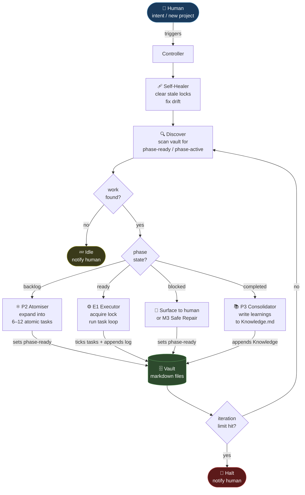

**Three rules that make this simple:**
1. The vault is the only state. No sidecar files.
2. Agents can only write to their own phase note and its log note.
3. `phase-active` tag + `locked_by` field = that phase is taken. No lock service needed.

---

## 1) Design Principles

### 1.1 Keep It Simple
- Prefer **conventions** over frameworks.
- Prefer **Obsidian-native** features (frontmatter, tags, links, folders).
- **Avoid parallel state systems.** One source of truth: the vault.

### 1.2 Vault Is the Database
- No Orchestrator.json as authority.
- No separate lock files. **The phase note is the lock.**
- No separate event store. **The log note is the event store.**
- Execution reads from the vault and writes back to the vault.
- If you need to know whether something is in-flight, read the vault.

### 1.3 Structure Is Portable
- Backlinks/navigation should be derivable from **directory placement**.
- A project folder can move; links can be rebuilt by maintenance.

### 1.4 Opt-in Enforcement
Only enforce GroundZeroOS rules for notes that are explicitly part of the execution system:
- either by **tags**
- or by explicit frontmatter fields

Everything else in the vault remains structural or notes docs etc.

### 1.5 Code Enforces, Vault Defines (learned)
TypeScript/code may validate and enforce the rules described here.
But the vault document is the authoritative spec — not the code.
If code and vault diverge on what a state means, the vault wins.

---

## 2) Interfaces (Execution Surfaces)

GroundZeroOS must be operable from:
- **Claude Code** (coding execution)
- **Cursor** (coding execution)
- **Web dashboard** (visibility + quick actions)
- **OpenClaw** (controller/routing surface)

All interfaces must use the same underlying contract: **phase nodes** + **logs** in the vault.
A minimal CLI can unify all modes — the interface is thin, the vault contract is the substance.

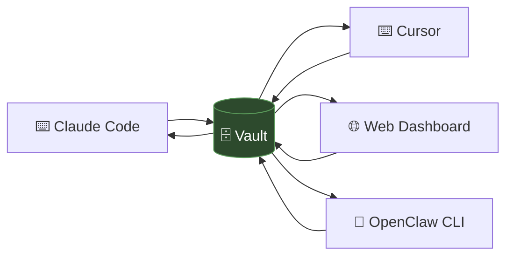

The vault is the bus. Interfaces are thin readers/writers — they don't hold state. the vault is the state machine 

---

## 3) Storage

### 3.1 Primary storage
- **Obsidian vault markdown files** (the only source of truth)

### 3.2 Link strategy
- Structure/backlinks are derived from **folder hierarchy**.
- Maintenance skill can rebuild nav and standard links after moves.

### 3.3 No parallel stores (learned)
The following are anti-patterns learned from the v0.1 implementation and must not be re-introduced:
- Separate `.lock.json` files outside the vault
- Separate orchestration event logs (`.jsonl` files) outside the vault
- TypeScript FSM state that is not immediately derived from vault frontmatter
- Agent/cursor session files as durable state (ephemeral only)

If you feel the need for one of these, the correct answer is: put it in the vault as a frontmatter field or a log note entry.

---

## 4) Vault Top-Level Subroots

Top-level folders are subroots anchored to the central dashboard node.

Example set (names can vary; concept must hold):
- Dashboard
- Life
- Fanvue
- Ventures
- Planning
- Finance
- System
- Archive
- Openclaw

---

## 5) Execution Bundle (Project Folder Contract)

A project that is executable by agents is represented as a **project bundle folder**.

### 5.1 Bundle layout

```
<Project>/
  <Project> - Overview.md
  <Project> - Knowledge.md
  <Project> - Kanban.md
  Phases/
    P1 - <Phase Name>.md
    P2 - <Phase Name>.md
  Logs/
    L1 - P1 - <Phase Name>.md
    L2 - P2 - <Phase Name>.md
  Docs/
    D1 - <Context>.md
    D2 - <Context>.md
```

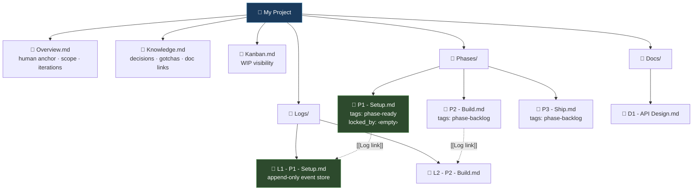

### 5.2 Bundle semantics
- **Overview**: inbox + scope + iterations. The human anchor.
- **Knowledge**: map of links to Docs + key learnings + decisions.
- **Kanban**: WIP visibility (not necessarily the executor source).
- **Phases/**: phase nodes with tasks + acceptance criteria.
- **Logs/**: append-only logs; stores agent outputs per phase.
- **Docs/**: deeper design/context docs (optional; linked from Knowledge).

### 5.3 Execution write rules (hard)
During execution, the agent may write only:
- the target Phase note (checkbox ticks, blockers, state tag, lock fields)
- the target Phase log note (append full output)

Agents do **not** free-write across the vault as part of execution.

---

## 6) Phase Node Contract

### 6.1 Phase structure (canonical sections)
Each phase note must contain:
- **Overview** (what this phase is)
- **Human Requirements** (secrets, env setup, approvals, anything agent cannot do)
- **Task List** (atomic, isolated, parallelisable; grounded in codebase)
- **Acceptance Criteria** (verifiable checks)
- **Blockers**
- **Log** (link to the phase log note in Logs/)

### 6.2 State model — tags are the FSM (canonical)

Tags are the **primary FSM**. The state tag is the single source of truth for what a phase is doing.

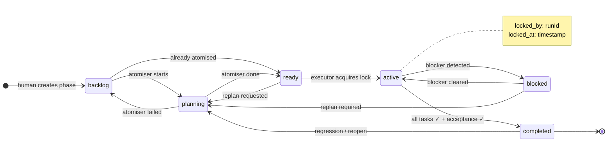

#### Required tags
- `project-phase` (marks this as an execution note)
- Exactly one state tag from the set below

#### Phase state tags and their semantics

| Tag | Meaning | Who sets it |
|---|---|---|
| `phase-backlog` | Exists but not yet scheduled | Human or planner |
| `phase-planning` | Atomiser is currently expanding this phase | Atomiser on start |
| `phase-ready` | Tasks atomised, ready to execute | Atomiser on complete |
| `phase-active` | Executor has claimed this phase and is running it | Executor on start |
| `phase-blocked` | Execution halted, needs human or replan | Executor on block |
| `phase-completed` | All tasks done, acceptance criteria met | Executor on finish |

#### Discovery rule (how agents find work)
```
tags include "project-phase"
AND tags include one of: "phase-ready" OR "phase-active"
```
`phase-active` is included so orphaned/stale executions can be detected and healed.

### 6.3 Minimal frontmatter

```yaml
---
tags: [project-phase, phase-active, fanvue]
project: Creator Agent Eval Suite
phase_number: 1
phase_name: Setup + Baseline
status: active
locked_by: run_20260330_143022_abc
locked_at: 2026-03-30T14:30:22Z
linear_identifier: FAN-123
linear_project: Creator Agent Eval Suite
---
```

`status` is a human-readable mirror of the tag (tags win on conflict). `locked_by` and `locked_at` are the vault-native lock (see §9). Both are empty string when not in-flight.

### 6.4 Logging link rule (KISS)
```md
## Log
- [[Logs/L1 - P1 - Setup + Baseline.md]]
```

---

## 7) Log Node Contract

A log note is append-only and is the **sole event store for a phase**.

### 7.1 Purpose
- Store **complete agent output** (what changed, diffs summary, commands run, tests, blockers).
- Store state transitions as timestamped entries (replaces separate orchestration log).
- Store lock acquire/release events (replaces separate lock audit trail).
- Store execution trace in plain text that the human can audit.

### 7.2 Minimal structure
```md
# L{n} — P{n} — {phase_name}

## Entries

### YYYY-MM-DD HH:MM — {runId}
**Event:** lock_acquired | task_started | task_done | state_transition | lock_released
**Task:** (if applicable)
**Result:** ...
**Files changed:** ...
**Commands / Tests:** ...
**Blockers:** ...
```

### 7.3 What goes in the log (learned)
Any event that would previously have gone to a separate `.jsonl` orchestration log goes here:
- Lock acquired / released (with runId)
- FSM state transitions (from → to + reason)
- Task start / tick / blocker
- Stale lock cleared by healer (with age)
- Acceptance criteria verified

The log note is the audit trail. There is no other audit trail.

---

## 8) Agent Roles & Skills

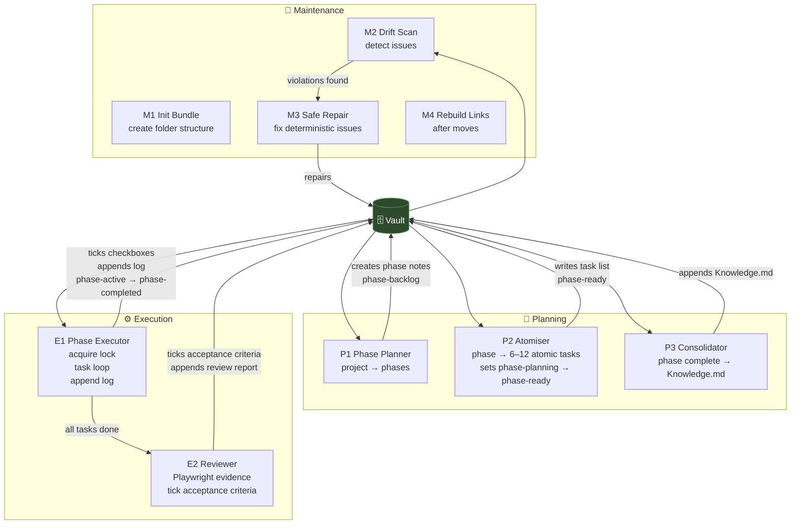

### 8.1 Bundle / Vault Maintenance

#### (M1) Initialise Project Bundle
**Input:** project name, target subroot/domain, optional repo path
**Output:** project folder with Overview/Knowledge/Kanban + Phases/Logs/Docs folders
**Rules:** never overwrite existing content; create missing only.

#### (M2) Vault Maintenance (Drift Scan)
**Purpose:** detect issues without touching non-GZ notes.
**Checks (opt-in only):**
- Phase notes missing required tags / multiple state tags
- Missing required sections (Task List, Acceptance Criteria, Log link)
- Broken internal links inside the bundle
- Bundle missing required files
- Phase state inconsistent with checkboxes (e.g. completed tag but unchecked acceptance)
- Stale locks: `phase-active` with `locked_at` older than 5 min threshold (see §9.3)
- `locked_by` present but no `phase-active` tag (orphaned lock field)

**Output:** a report note (or console output) listing violations.

#### (M3) Vault Maintenance (Safe Repair)
**Purpose:** apply safe, deterministic fixes.
**Allowed repairs:**
- rebuild `## 🔗 Navigation` blocks
- fix missing Log link by creating log file and inserting link
- normalise tags (ensure exactly one phase state tag)
- create missing bundle files/folders
- clear stale locks: remove `locked_by`/`locked_at`, revert tag to `phase-ready`, append log entry

**Not allowed without explicit approval:**
- deleting notes
- moving project folders automatically
- rewriting human-written content beyond templated sections

#### (M4) Rebuild Links After Move
Given a moved bundle, re-derive: nav `UP` links, hub links, internal bundle links.


### 8.2 Phase Planning / Atomization / Synthesization

#### (P1) Phase Planner (Project → Phases)
**Input:** Project Overview + repo scan (optional)
**Output:** `Phases/P1..Pn` notes with objective, human requirements, task skeleton, acceptance criteria, log link.

#### (P2) Atomizer (Phase → Atomic Tasks)
**Input:** one phase note + repo context
**Output:** rewrite/insert the Task List as 6–12 atomic tasks; each with files/symbols, steps, validation command.
**Constraint:** tasks must be parallelisable where possible; avoid giant "do everything" tasks.
**Lock behaviour:** Atomizer sets `phase-planning` on start, `phase-ready` on complete.

#### (P3) Synthesizer / Consolidator
**Purpose:** after a phase completes, consolidate learnings into Knowledge + Docs.
**Output:** append to `<Project> - Knowledge.md`: decisions, gotchas, links to docs, links to phase log.


### 8.3 Execution + Review

#### (E1) Phase Executor
**Input:** a phase note
**Pre-condition:** acquire vault lock (§9) — abort if already locked by another run.
**Loop:**
1. Append `lock_acquired` entry to log note
2. Select next unchecked atomic task
3. Execute via Claude Code / Cursor
4. Tick task checkbox in phase note
5. Append full output to phase log note
6. Update blockers / phase state tag if needed
7. Loop until done or blocked

**Completion rule:** when acceptance criteria satisfied and all tasks ticked → set `phase-completed`, release lock.

#### (E2) Phase Reviewer (Playwright)
**Input:** repo + acceptance criteria
**Output:** evidence + reviewer report appended to phase log + tick verified acceptance criteria.


### 8.4 Linear Import (Optional Mode)

#### (L1) Import Linear Project → Bundle
**Input:** Linear project
**Output:** new bundle with phases seeded from epics/issues, tasks from issue checklists.
**Rule:** Linear fields optional; vault stays authoritative.

---

## 9) Vault-Native Locking (Concurrency Model)

This section closes the v0.1 open question about multi-agent concurrency. The mechanism is vault-native — no external lock files needed.

### 9.1 The lock IS the phase note

A phase is locked when:
1. Its tag is `phase-active` AND
2. Its frontmatter contains a non-empty `locked_by: <runId>` AND `locked_at: <ISO timestamp>`

There is no other lock. No `.lock.json` file. No lock directory. Reading the phase note tells you everything.

### 9.2 Lock lifecycle

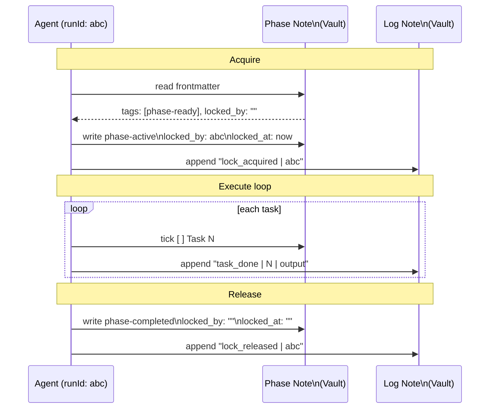

### 9.3 Stale lock detection and healing

A lock is stale when: `phase-active` tag AND `locked_at` is older than **5 minutes** (configurable).

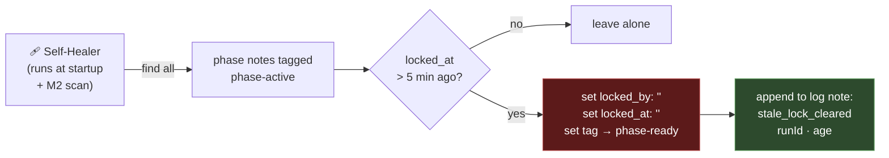

The self-healer **scans phase notes, not a lock directory**. There is no lock directory.

### 9.4 Multi-agent concurrency

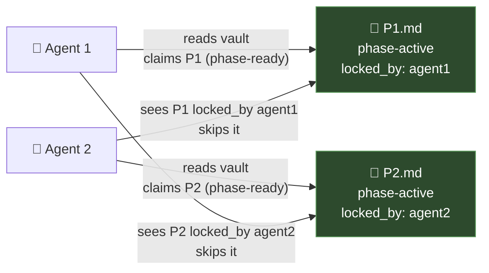

Multiple agents coordinate through the vault. No central coordinator. No lock service.

---

## 10) FSM Transition Table (Canonical)

This is the authoritative FSM. Code may enforce it; this document defines it.

### 10.1 Phase transitions

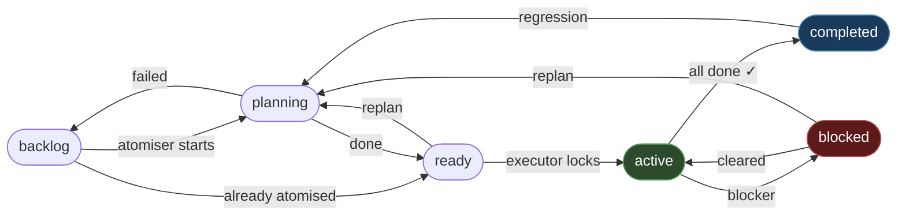

Illegal transitions must be refused. If code attempts a transition not listed, it is a bug.

### 10.2 Routing table (what to do given phase state)

| Phase state | Valid operations |
|---|---|
| `phase-backlog` | atomise |
| `phase-planning` | wait (atomiser in flight) |
| `phase-ready` | atomise (refine), execute |
| `phase-active` | execute, mark-blocked |
| `phase-blocked` | heal, replan |
| `phase-completed` | consolidate |

### 10.3 Project-level state — derive, don't store (learned)

Project status is **derived** from phase states at read time. Never stored as a separate field.

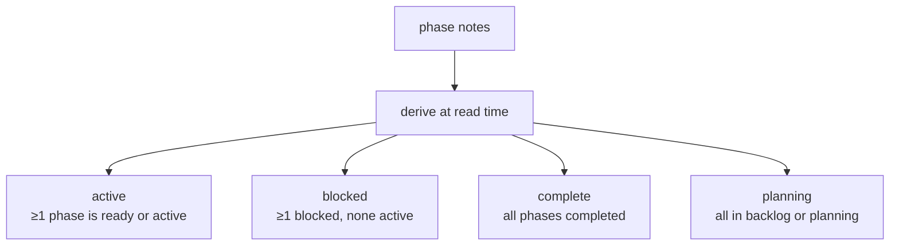

---

## 11) Execution Semantics (How Agents Behave)

### 11.1 The full execution loop

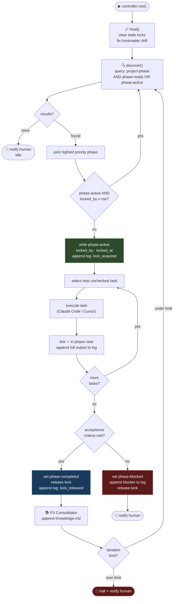

### 11.2 Scope discipline
Only act on phase notes explicitly in the execution system. Don't touch freeform vault notes.

### 11.3 Output discipline
All execution outputs go to the phase's corresponding **log note**.
Phase note updated only for: task checkbox ticks, blockers, state tag, lock fields.

### 11.4 Iteration guard (learned)
The controller loop must have a hard iteration limit (e.g. 20 iterations per run).
Exceeding it = halt + log entry + surface to human. Never loop forever.

---

## 12) Templates (Canonical)

### 12.1 Phase Note Template

```md
---
tags: [project-phase, phase-ready, <domain>]
project: <Project Name>
phase_number: 1
phase_name: <Phase Name>
status: ready
locked_by:
locked_at:
---

## 🔗 Navigation
**UP:** [[<Project> - Overview]]

# P1 — <Phase Name>

## Overview

## Human Requirements
- (env setup, secrets, approvals, manual steps)

## Task List
- [ ] Task 1
- [ ] Task 2

## Acceptance Criteria
- [ ] Criterion 1
- [ ] Criterion 2

## Blockers
- None

## Log
- [[Logs/L1 - P1 - <Phase Name>.md]]
```

### 12.2 Log Note Template

```md
---
tags: [phase-log, <domain>]
project: <Project Name>
phase_number: 1
phase_name: <Phase Name>
---

# L1 — P1 — <Phase Name>

## Entries

### YYYY-MM-DD HH:MM — <runId>
**Event:** lock_acquired
**RunId:** ...

---
```

---

## 13) Anti-Patterns (Learned from Implementation)

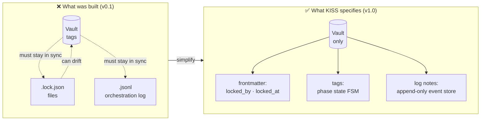

| Anti-pattern | Why it hurts | Vault-native fix |
|---|---|---|
| Separate `.lock.json` files outside the vault | Invisible in Obsidian, healer needs its own scan loop, can drift | `locked_by` + `locked_at` on the phase note — the note IS the lock |
| TypeScript FSM as primary truth | Code and vault drift; two sources of truth | Tags are primary; TypeScript validates against §10 table |
| Separate `.jsonl` orchestration event log | Third state system, invisible in vault, hard to correlate | All events appended to the phase log note |
| Project status as a stored field | Drifts from phase states, requires sync code | Derived from phase states at read time — never stored |
| Self-healer scanning a lock directory | Needs to know about a directory that shouldn't exist | Healer scans phase notes tagged `phase-active`, checks `locked_at` |
| Agent session files as durable state | Ephemeral data treated as durable, accumulates garbage | Ephemeral only; what ran is recorded in the log note |
| `status` field as independent FSM from tags | Two fields that must agree creates sync bugs | `status` is human-readable mirror; tags win on conflict |

---

## 14) Open Questions (v1.0)

Deliberately deferred — add only when a concrete failure mode proves them necessary:
- Global project registry / cross-project dependency modelling
- Automatic hub generation across the entire vault
- Phase-level parallelism within a single phase (multiple agents on different tasks in one phase)

---

## 15) Versioning

- This doc is the **v1.0** scope.
- v0.1 → v1.0 changes: §9 (vault-native locking), §10 (FSM table), §11.4 (iteration guard), §13 (anti-patterns), §3.3 (no parallel stores), §1.5 (code enforces vault defines), §10.3 (derived project state), diagrams throughout.
- Changes must be additive and justified by a concrete failure mode.
- When a new version is needed, increment `version` in frontmatter and add a note here.

---

## 16) User Flows

These flows cover every mode of use from first idea to shipped phase. Each flow is a self-contained journey — a human or agent can enter at any point.

---

### UF-1 — Project Genesis (New Project from Scratch)

> **Trigger:** Human has a new idea or initiative they want to track and execute.

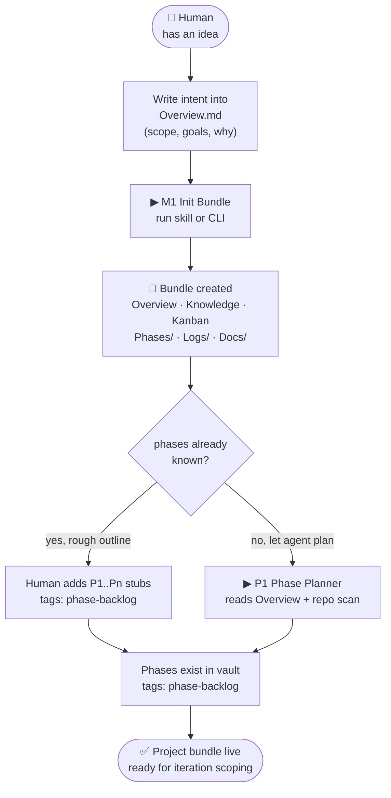

**What the human writes:** Overview.md (intent, scope, why, repo path).
**What the agent creates:** all folders, all stub files, optionally the phase list.
**Vault state after:** `P1..Pn` notes exist with `phase-backlog` tag. No tasks yet.

---

### UF-2 — Iteration Scoping (Deciding What to Work on Next)

> **Trigger:** Human wants to decide which phase(s) to activate for this sprint/session.

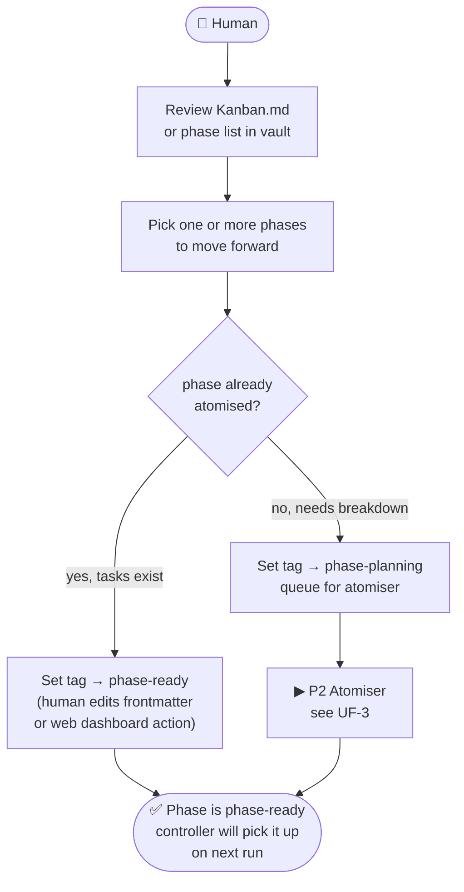

**Key principle:** Human controls *which* phases are active. Agents control *how* they get executed.
**Vault state after:** selected phases have `phase-ready` tag. Everything else stays `phase-backlog`.

---

### UF-3 — Atomising a Phase (Phase → Atomic Tasks)

> **Trigger:** A phase exists with `phase-backlog` or `phase-ready` but tasks are not yet grounded in the codebase.

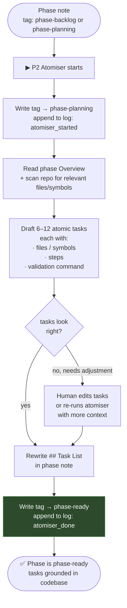

**Atomiser rules:**
- Never delete existing human-written content (Overview, Human Requirements).
- Only rewrite the `## Task List` section.
- Each task must map to a specific file path or symbol — no vague tasks.
- 6–12 tasks. If more, split into two phases.

**Vault state after:** `## Task List` populated, tag = `phase-ready`, log entry appended.

---

### UF-4 — Phase Execution (Running a Phase)

> **Trigger:** Controller finds a phase tagged `phase-ready`. Executor picks it up.

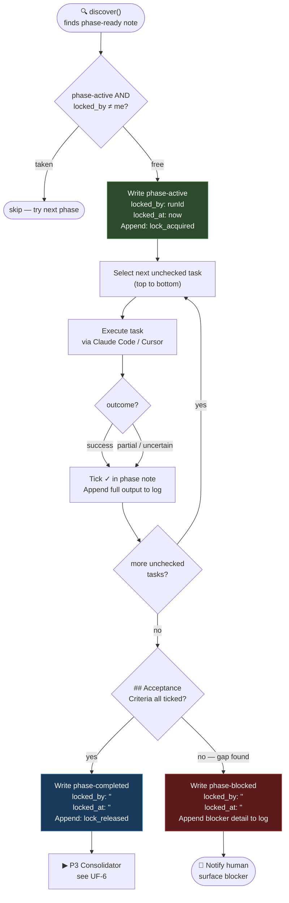

**What the executor touches:**
- Phase note: checkbox ticks, state tag, lock fields only.
- Log note: appends every event (lock, task output, blocker, state change).
- Nothing else in the vault.

**Vault state after (success):** tag = `phase-completed`, all tasks ticked, log is the full trace.
**Vault state after (blocked):** tag = `phase-blocked`, blocker described in log + `## Blockers` section.

---

### UF-5 — Blocked Phase Recovery

> **Trigger:** A phase is tagged `phase-blocked`. Human needs to unblock it.

```mermaid
flowchart TD
    Blocked(["Phase tagged phase-blocked"]) --> Read["Human reads\nphase note ## Blockers\n+ log note for context"]
    Read --> Decide{blocker type?}

    Decide -->|missing env / secret / access| Fix["Human takes action\n(sets env var, grants access, etc.)"]
    Decide -->|tasks are wrong / stale| Replan["▶ Replan\nHuman edits ## Task List\nor re-runs P2 Atomiser"]
    Decide -->|external dependency| Wait["Human notes in ## Blockers\nthat it is waiting on X\nleaves as phase-blocked"]
    Decide -->|design needs rethink| Scope["Human updates ## Overview\nand ## Human Requirements\nthen re-atomises"]

    Fix --> Clear["Set tag → phase-ready\nClear ## Blockers\nAppend to log: blocker_cleared"]
    Replan --> Clear
    Scope --> P2["▶ P2 Atomiser\nre-atomise with updated scope"]
    P2 --> Clear

    Clear --> Resume(["✅ Phase is phase-ready\ncontroller picks up on next run"])

    style Clear fill:#2d4a2d,color:#fff,stroke:#5a9a5a
```

**Rule:** Only humans clear blockers. Agents do not self-clear blocked phases (except stale locks, which are a different thing — see §9.3).

---

### UF-6 — Phase Consolidation (Capturing Learnings)

> **Trigger:** A phase reaches `phase-completed`. P3 Consolidator runs.

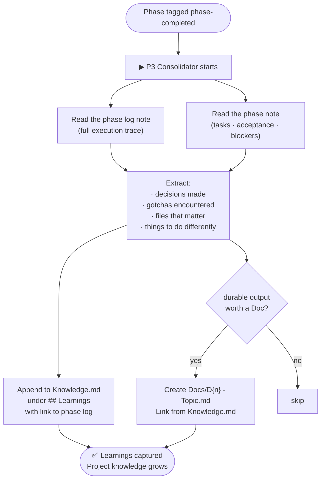

**What consolidation is not:** a summary of what was done (that's in the log). It's the **durable signal** — what should influence the next person or agent touching this project.

---

### UF-7 — Vault Drift Repair (Maintenance Run)

> **Trigger:** Scheduled, or human suspects something is wrong, or controller detects an issue.

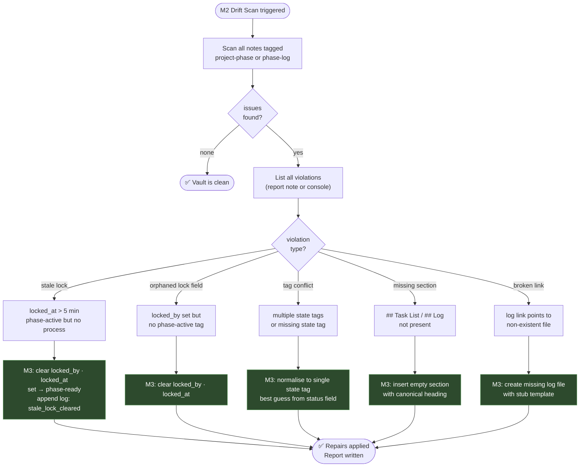

**M3 never:** deletes notes, moves folders, rewrites human-written content.

---

### UF-8 — Multi-Phase Project: Full Lifecycle

> The end-to-end journey of a project from idea to completion across multiple phases.

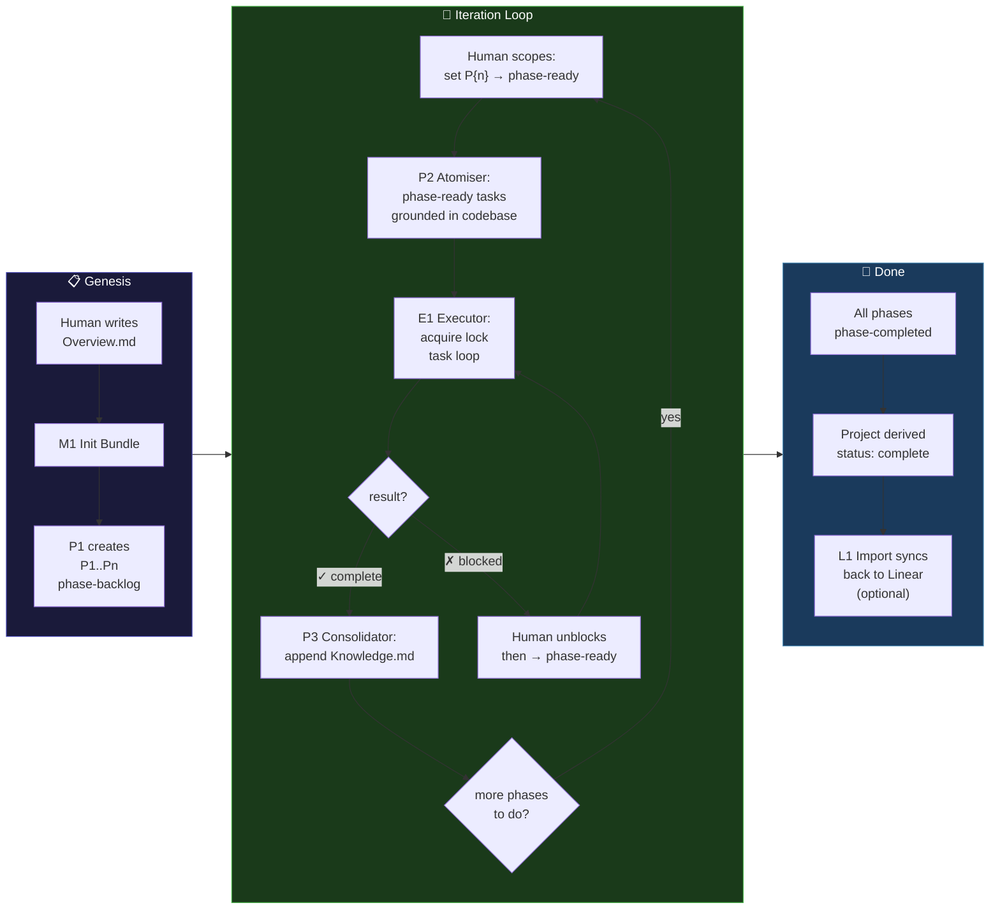

---

### UF-9 — Linear Import (External Project → Bundle)

> **Trigger:** A project already exists in Linear and needs to be mirrored into the vault for execution.

```mermaid
flowchart TD
    H([👤 Human]) --> L1["▶ L1 Import\nprovide Linear project ID"]
    L1 --> Fetch["Fetch epics + issues\nfrom Linear API"]
    Fetch --> MapPhases["Map epics → Phase notes\nMap issues → task stubs\nin ## Task List"]
    MapPhases --> Create["Create bundle\nPhases/ with frontmatter:\nlinear_identifier · linear_project"]
    Create --> Flag["Mark tasks that need\nmore codebase grounding\n(≠ 'grounded in repo')"]
    Flag --> Check{needs\natomising?}
    Check -->|yes| P2["▶ P2 Atomiser\nground tasks in actual files"]
    Check -->|no, Linear tasks are specific enough| SetReady["Set tag → phase-ready"]
    P2 --> SetReady
    SetReady --> Done(["✅ Bundle live\nLinear fields preserved\nvault is authoritative"])
```

**Rule:** after import, vault is the authority. Linear becomes a display layer, not the source of truth.

---

### UF-10 — Agent Handoff (One Agent Picks Up Where Another Left Off)

> **Trigger:** A new Claude Code / Cursor session starts on a project that is mid-execution.

```mermaid
flowchart TD
    NewSession([🤖 New agent session starts]) --> ReadPhase["Read the phase note\n(frontmatter + task list)"]
    ReadPhase --> CheckLock{locked_by\nset?}

    CheckLock -->|empty| Fresh["Phase is phase-ready\nor was just released\nproceed normally"]
    CheckLock -->|my runId| Reentrant["Re-entrant — I already\nown this lock\nproceed"]
    CheckLock -->|someone else's runId| Age{locked_at\nage?}

    Age -->|"< 5 min"| Wait["Another run is live\nskip this phase\ntry another"]
    Age -->|"> 5 min"| Stale["Stale lock\nSelf-healer clears it\nphase reverts → phase-ready"]

    Fresh --> ReadLog["Read log note\nto understand what\nhas already been done"]
    Reentrant --> ReadLog
    Stale --> ReadLog

    ReadLog --> Resume(["Continue from\nnext unchecked task\nas if nothing happened"])
```

**The log note is the handoff document.** A new agent reads it and knows exactly what ran, what succeeded, and what the last state was. No separate handoff file needed.

